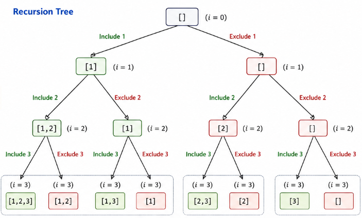

# LeetCode 78 – Subsets

## Problem

Given an array of integers, return all possible subsets of the array.

For example, for `[1, 2, 3]`, there are 8 possible subsets.

```text
[]
[1]
[2]
[3]
[1,2]
[1,3]
[2,3]
[1,2,3]
```

## Approach

I used **recursion and backtracking**.

For every element, there are two choices:

* Include the element
* Exclude the element

The recursion explores both choices until all elements are processed.

After including an element, `pop_back()` removes it before exploring the exclude choice. This is the **backtracking** step.

## Recursion Tree

The complete recursion tree for `[1, 2, 3]`:



## Simple Logic

```text
Include → Go deeper → Backtrack → Exclude → Go deeper
```

When `i == nums.size()`, the current subset is added to `allsubsets`.

## Example

**Input:**

```text
[1, 2, 3]
```

**Output:**

```text
[1,2,3]
[1,2]
[1,3]
[1]
[2,3]
[2]
[3]
[]
```

## Complexity

**Time Complexity:** `O(2^n)`

Each element has 2 choices: include or exclude.

**Space Complexity:** `O(n)`

This is for the recursion stack and the current subset. The output space is not counted.
